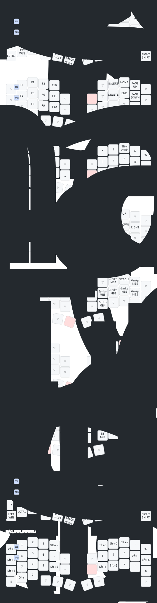

# zmk-config-roBa



## Local build

This repository can be built locally with Docker.

```bash
./scripts/local-build.sh
```

Build only one target:

```bash
./scripts/local-build.sh roBa_R
./scripts/local-build.sh roBa_L
./scripts/local-build.sh settings_reset
```

Artifacts are written to `dist/`.
